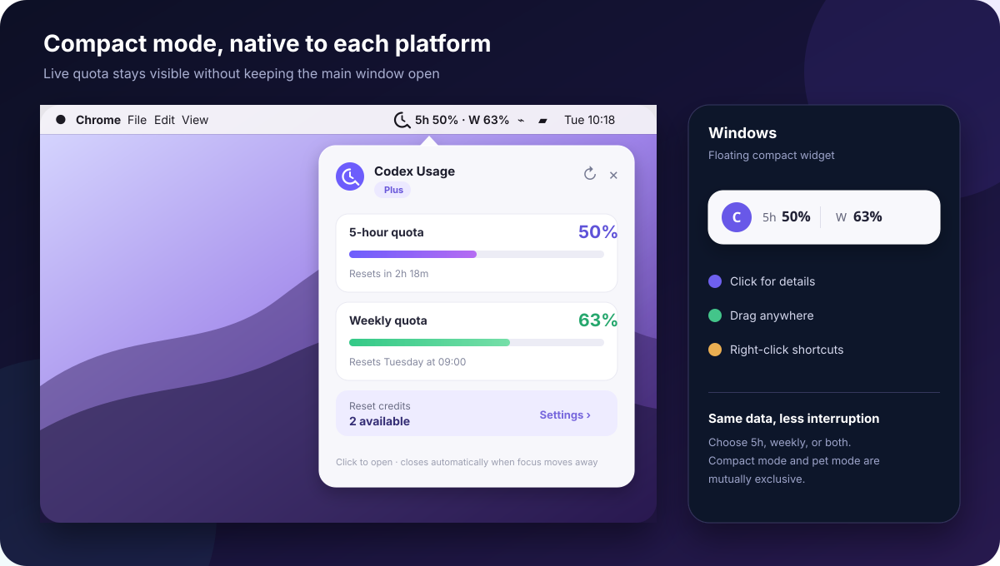

<div align="center">
  
  <h1>QuotaMate</h1>
  <p><strong>轻量、本地运行、常驻菜单栏/系统托盘的 Codex 额度助手</strong></p>
  <p>
    <a href="README.md">简体中文</a> · <a href="README_EN.md">English</a>
  </p>
  <p>
    
    
    
    
    
  </p>
</div>

QuotaMate 把 Codex 的 **5 小时额度、一周额度、重置倒计时和额度重置卡** 放到桌面与系统托盘中。你可以使用极简额度条，也可以让一个会随额度变化的桌面宠物陪着你，无需反复打开 Codex 查看用量。

应用直接连接本机已经安装并登录的 Codex CLI：不要求粘贴 Token，不抓取网页，也不把额度数据发送到 QuotaMate 自建服务器。

> [!IMPORTANT]
> QuotaMate 是社区开发的第三方工具，并非 OpenAI 官方产品。目前支持 Windows x64，并提供 Apple Silicon macOS 版本。

<p align="center">
  
</p>

## 桌面宠物：让额度真正“活”起来

QuotaMate 的重点不是再做一张冷冰冰的统计面板，而是把频繁变化的 **5 小时额度变成一个一直陪在桌面的角色**。你不需要读进度条：看一眼宠物的表情、颜色和能量，就知道现在适不适合继续让 Codex 火力全开。

<p align="center">
  
</p>

### 它会感知你的 5 小时额度

| 5h 剩余额度 | 宠物状态 | 视觉反馈 |
| --- | --- | --- |
| `75%–100%` | 能量充足 | 蓝色能量、开心表情、更加活跃的光效 |
| `45%–74%` | 状态良好 | 绿色能量、放松表情、自然呼吸运动 |
| `20%–44%` | 能量偏低 | 橙色警示、平静表情、能量条明显缩短 |
| `0%–19%` | 需要充能 | 红色警示、疲惫表情和低能量姿态 |

状态优先跟随更新更频繁的 5 小时额度；只有 Codex 没有返回 5 小时数据时，才回退使用一周额度。

### 它不是一张静止贴图

- 宠物会持续轻微上下浮动，让桌面保持生动但不过度打扰。
- 紫色小狐会眨眼、摇尾巴、抖耳朵，能量充足时还会出现闪光。
- 火箭会根据额度改变燃料与火焰，汽车显示电池格，机器人和小狗会改变表情与能量条。
- 点击宠物会展开完整额度；鼠标移开后，它会自动回到纯宠物形态。
- 按住左键移动即可拖动，右键则能切换模式、打开主界面或关闭浮窗。

### 把你喜欢的角色放到桌面

除了紫色小狐、小狗、火箭、汽车和机器人，你还可以导入透明 `PNG`、`WebP` 或动态 `GIF`：

- 图片会复制到 QuotaMate 的本地配置目录，不依赖原文件一直存在。
- 历史记录会保留导入过的宠物，可随时切换或删除本地副本。
- 自定义图片同样拥有轻微浮动和随额度变色的能量光效。
- 动态 GIF 会保留自身动画；静态自定义图片不会被强行修改内部表情。
- 可调节宠物大小、整体透明度和是否始终置顶。

## 简洁模式：不打扰，但一直看得见

并不是所有人都希望桌面上一直有一个角色。简洁模式只保留最重要的数字，适合专注工作、演示或屏幕空间有限的场景。你可以选择只看更新最频繁的 `5h` 额度、只看一周额度，或者同时显示两项。

<p align="center">
  
</p>

### macOS：额度直接常驻菜单栏

在 macOS 开启简洁模式后，QuotaMate 不会再创建一个普通桌面浮窗，而是把额度作为原生菜单栏文字固定显示在屏幕右上角，例如 `5h 99% · W 58%`：

- 无论正在使用浏览器、终端还是其他应用，都能直接看到最新额度。
- 可在设置中选择 `仅 5h`、`仅一周` 或 `全部`，菜单栏文字会立即同步变化。
- 点击菜单栏中的 QuotaMate 图标，会在图标下方展开详细面板，查看重置倒计时、准确时间、账号等级、额度重置卡和下次计划任务。
- 鼠标移开详细面板后自动收起，不会长期遮挡当前应用。
- 退出主窗口后仍可驻留菜单栏；配合开机自启动，可以把它当成长期运行的额度仪表。

### Windows：一条刚刚好的桌面额度条

Windows 的简洁模式使用无边框桌面浮窗，仅显示你选择的内容：

- 收起宽度会根据 `5h`、`W` 或两项内容自动调整，不留下多余空白。
- 单击并松开可展开完整信息；鼠标移开后自动恢复简洁状态。
- 按住左键移动即可拖动，不会把拖动误判为展开；也可以锁定位置。
- 右键可以打开主界面、切换到宠物模式或关闭浮窗。

简洁模式与桌面宠物互斥，避免桌面同时出现两套常驻显示；但主界面可以与当前模式同时打开，调整设置时能够实时看到效果。

## 额度信息，不只是百分比

展开主界面、简洁浮窗或宠物详情后，可以看到：

- 当前 Codex/ChatGPT 等级，例如 `ChatGPT Plus`、`ChatGPT Pro` 或服务端返回的其他等级。
- 5 小时额度与一周额度、剩余百分比和重置时间。
- 账号可用的额度重置卡数量、获得时间和到期时间。
- 下次计划任务时间与最近一次数据更新时间。

等级来自官方 Codex App Server 返回的 `planType`；如果当前登录方式或账号没有返回该字段，界面会明确显示“暂未返回”。

## 其他体验

| 能力 | 说明 |
| --- | --- |
| 极简额度条 | macOS 将所选额度作为原生菜单栏文字常驻显示；Windows 使用可拖动、可展开的桌面额度条。 |
| 本地优先 | 复用 Codex 现有登录状态，不要求复制认证 Token，也不经过额外服务。 |
| 托盘快捷控制 | 主窗口关闭后继续工作，可快速刷新、切换模式、设置自启动或退出。 |
| 多显示器支持 | 主界面与浮窗都可移动到其他显示器，浮窗会记住上次位置。 |
| 中英文界面 | 默认跟随操作系统显示语言，也可以手动选择中文或英文。 |

## 主要功能

### 1. 额度总览

- 显示 Codex 5 小时额度和一周额度。
- 显示当前 Codex/ChatGPT 账号等级，例如 Plus、Pro 或 Go；未返回时会明确提示。
- 显示剩余百分比、重置倒计时和具体重置时间。
- 显示账号返回的额度重置卡数量、获得时间及到期时间。
- 支持手动刷新，也会接收 Codex 的即时额度更新通知。
- 某项数据未由当前账号返回时，会明确显示为“不可用”，不会伪造数值。

### 2. 简洁模式

适合希望桌面尽量干净、只保留核心数字的用户。macOS 会把所选额度直接放在右上角菜单栏；Windows 继续使用简洁浮窗。

- 可选择只显示 `5h`、只显示“一周”，或者两项同时显示。
- 收起宽度随所选内容自动变化，不额外占用桌面空间。
- 单击展开详细信息，鼠标移开后自动收起。
- 按住鼠标左键并移动即可拖动；也可以锁定位置防止误触。
- 右键可打开主界面、切换到桌面宠物或关闭浮窗。

### 3. 桌面宠物

宠物不只是装饰，它会把 5 小时额度转化为直观的状态反馈。

- 内置紫色小狐、小狗、火箭、汽车和机器人。
- 宠物表情、主题颜色、燃料或电量效果会随 5 小时额度变化。
- 宠物头部显示一周额度，底部显示 5 小时额度与当前能量状态。
- 支持透明 PNG、WebP 和 GIF 自定义宠物。
- 自动保存自定义图片历史，可快速重新选择或删除本地副本。
- 支持调整大小、透明度和置顶状态。
- 单击宠物展开完整额度信息，鼠标移开后恢复宠物模式。

### 4. 菜单栏与系统托盘

QuotaMate 在 macOS 驻留于右上角菜单栏，在 Windows 驻留于右下角通知区域。

- 左键托盘图标：打开主界面。
- 悬停托盘图标：查看 5 小时和周额度概况。
- 右键托盘图标：打开主界面、切换简洁/宠物/隐藏模式、刷新额度、打开计划任务或设置、切换开机自启动、退出程序。
- 当前显示模式和开机启动状态会使用 `●` 标记。

### 5. 每日计划任务

可以设置多个本地时间，让 QuotaMate 每天启动一次最小化、临时的 Codex 会话：

- 任务在 QuotaMate 独立运行目录中执行。
- 使用只读沙箱，不以你的项目目录作为工作目录。
- 不保存 Codex 对话，不自动重试，单次最长 120 秒。
- 同一计划在同一自然日最多执行一次。
- 电脑关机、休眠或 QuotaMate 完全退出时不会执行，之后也不会补跑。

> [!NOTE]
> 计划任务会实际调用 Codex，可能产生少量额度消耗。不需要此功能时，请保持计划列表为空或关闭计划任务。

## 工作方式

<p align="center">
  
</p>

QuotaMate 会在本机查找 `codex.exe`，启动官方 Codex App Server 并读取当前账号返回的额度信息。前端只通过 Tauri 的本地 IPC 与 Rust 后端通信。

## 快速开始

在 Apple Silicon Mac 上从源码构建：

```bash
pnpm install
pnpm tauri:build:mac
```

产物会写入 `artifacts/macos-arm64/`。专用脚本会在本机临时目录构建，从而避开部分外接磁盘产生的 `._*` AppleDouble 文件。

### 运行要求

- macOS 10.15 或更高版本（当前构建为 Apple Silicon/arm64），或 Windows 10/11（x64）
- Windows 需要 Microsoft Edge WebView2 Runtime（多数 Windows 10/11 电脑已预装）；macOS 使用系统 WebKit
- 已安装并登录 Codex CLI，或已安装包含 Codex CLI 的 Codex 桌面应用

QuotaMate 会先从系统 `PATH` 查找 `codex.exe`，然后尝试识别 Codex 桌面应用附带的 CLI。

### 下载

前往本仓库的 [Releases](../../releases/latest) 页面。普通用户推荐下载安装版：

```text
QuotaMate_0.1.0_x64-setup.exe
```

如果不想安装，可以下载单文件版本：

```text
quotamate.exe
```

免安装版可以直接运行，但配置、日志和自定义宠物图片仍会写入当前 Windows 用户的应用数据目录，所以它不是“完全不落盘”的绿色软件。

> [!WARNING]
> 当前发布文件尚未使用受信任的代码签名证书。Windows 首次运行时可能显示“未知发布者”或 SmartScreen 提醒。请确认文件来自本仓库的 Releases 页面，再选择“更多信息”→“仍要运行”。

### 第一次使用

1. 确认 Codex 已经安装并登录。
2. 启动 QuotaMate，等待主界面显示首次额度快照。
3. 打开“设置”，选择简洁模式或桌面宠物。
4. 根据需要调整显示项目、透明度、宠物大小、置顶和刷新间隔。
5. 关闭主窗口后，QuotaMate 会继续驻留托盘；需要完全关闭时，从托盘菜单选择“退出”。

## 操作速查

| 位置 | 操作 | 结果 |
| --- | --- | --- |
| 托盘图标 | 左键单击 | 打开 QuotaMate 主界面 |
| 托盘图标 | 右键单击 | 打开快捷菜单 |
| 收起的浮窗/宠物 | 左键单击后松开 | 展开详细额度 |
| 收起的浮窗/宠物 | 按住左键并移动 | 拖动浮窗 |
| 展开的浮窗/宠物 | 鼠标移开 | 自动恢复简洁/宠物模式 |
| 浮窗/宠物 | 右键单击 | 打开浮窗快捷菜单 |

## 隐私与安全

- 不要求用户输入、复制或导入访问令牌。
- 不写入 Authorization Header、Cookie 或 Codex 对话内容。
- 不将额度信息上传到 QuotaMate 自建服务器或其他第三方服务。
- 配置、自定义宠物图片和运行日志均保存在本机。
- 日志检测到可能包含认证信息的诊断内容时会进行隐藏处理。
- 计划任务使用临时会话、独立运行目录和只读沙箱。

## 常见问题

<details>
<summary><strong>为什么显示“Codex 不可用”或一直等待数据？</strong></summary>

请确认 Codex CLI 已安装、已经登录，并能在终端中正常运行 `codex --version`。随后从托盘菜单选择“刷新额度”，或重启 QuotaMate。
</details>

<details>
<summary><strong>为什么 5h 已经重置，宠物之前仍显示能量偏低？</strong></summary>

从当前版本开始，宠物状态优先跟随 5 小时额度。只有 Codex 未返回 5 小时额度时，才使用一周额度作为备用状态来源。
</details>

<details>
<summary><strong>电脑关机后，计划任务还会执行吗？</strong></summary>

不会。QuotaMate 不是 Windows 计划任务服务；电脑关机、休眠或应用完全退出时，触发不会执行，之后也不会补执行。
</details>

<details>
<summary><strong>发布时需要上传整个 target/release 文件夹吗？</strong></summary>

不需要。`.pdb`、`.dll`、`.lib`、`.d` 等属于编译或调试产物。普通用户只需要安装包，或单独的 `quotamate.exe`。
</details>

## 从源码运行

### 开发环境

- Node.js 与 pnpm
- Rust stable（MSVC 工具链）
- Visual Studio C++ Build Tools
- 已安装并登录的 Codex CLI

```powershell
# 安装依赖并启动开发版
pnpm install
pnpm tauri dev

# 构建前端
pnpm build

# 运行 Rust 单元测试
cd src-tauri
cargo test --lib
```

生成免安装 EXE：

```powershell
pnpm tauri build --no-bundle
```

生成 NSIS 安装包：

```powershell
pnpm tauri build
```

默认输出位置：

```text
src-tauri/target/release/quotamate.exe
src-tauri/target/release/bundle/nsis/QuotaMate_<版本号>_x64-setup.exe
```

## 技术栈与项目结构

- [Tauri 2](https://tauri.app/)：跨平台窗口、macOS 菜单栏、Windows 系统托盘和本地 IPC
- [Rust](https://www.rust-lang.org/)：Codex App Server、配置、计划任务和窗口管理
- [React](https://react.dev/) + [TypeScript](https://www.typescriptlang.org/)：主界面与浮窗
- [Vite](https://vite.dev/)：前端开发与构建

```text
QuotaMate/
├─ src/                         # React 界面、浮窗、宠物与国际化
├─ src-tauri/src/codex/         # CLI 查找、App Server 和额度解析
├─ src-tauri/src/config/        # 本地配置与版本迁移
├─ src-tauri/src/scheduler/     # 每日计划任务
├─ src-tauri/src/tray/          # macOS 菜单栏与 Windows 系统托盘
├─ src-tauri/src/windows/       # 主窗口与浮窗生命周期
├─ docs/images/                 # README 产品示意图
└─ src-tauri/src/commands.rs    # 前后端 IPC 命令
```

## 当前状态与反馈

QuotaMate 仍处于早期版本。不同 Codex CLI 版本或账号类型返回的额度字段可能不同；未返回的数据会显示为不可用。

欢迎通过 GitHub Issues 提交 Bug、功能建议和界面反馈。提交日志或截图前，请先确认其中不包含账号凭据或其他敏感信息。
