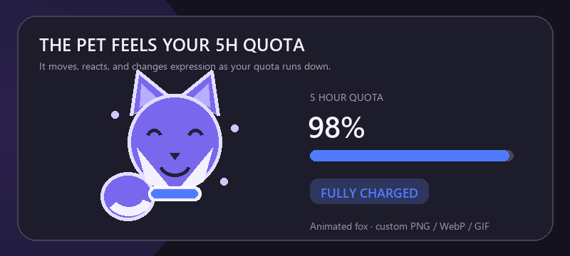
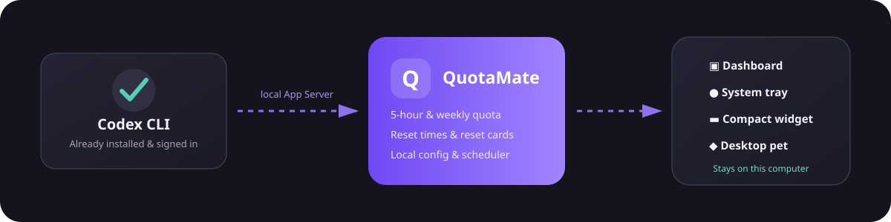

<div align="center">
  
  <h1>QuotaMate</h1>
  <p><strong>把 Codex 额度放进菜单栏、系统托盘和桌面宠物</strong></p>
  <p><a href="README.md">简体中文</a> · <a href="README_EN.md">English</a></p>
  <p>
    
    
    
    
    <a href="LICENSE"></a>
  </p>
  <p><a href="https://github.com/yueyisui/QuotaMate/releases/latest"><strong>下载最新版本</strong></a> · <a href="#第一次使用">第一次使用</a> · <a href="#从源码构建">从源码构建</a></p>
</div>

QuotaMate 是一个轻量的 Codex 额度助手。它读取本机 Codex CLI 返回的 **5 小时额度、一周额度、重置时间和额度重置卡**，用简洁显示或桌面宠物持续呈现，不需要反复打开 Codex 查看用量。

应用复用 Codex 已有的登录状态，不要求粘贴 Token，不抓取网页，也不会把额度数据发送到 QuotaMate 自建服务器。

> [!IMPORTANT]
> QuotaMate 是社区开发的第三方工具，并非 OpenAI 官方产品。当前发布版支持 Windows x64 和 Apple Silicon Mac。

## 一眼看懂

| 能力 | 说明 |
| --- | --- |
| 实时额度 | 显示 5 小时与一周剩余额度、重置倒计时和准确时间 |
| 两种常驻方式 | macOS 菜单栏 / Windows 简洁浮窗，或跨平台桌面宠物 |
| 自定义宠物 | 导入透明 PNG、WebP 或动态 GIF，保留本地历史记录 |
| 本地优先 | 直接连接本机 Codex App Server，不经过额外额度服务 |
| 计划任务 | 在指定本地时间运行一次最小化、只读的 Codex 会话 |
| 桌面体验 | 中英文界面、多显示器、位置记忆、透明度与开机启动 |

## 简洁模式

简洁模式只保留最重要的数字。可以显示 `5h`、`W`，或同时显示两项；它与宠物模式互斥，避免桌面出现两套重复信息。

<p align="center">
  
</p>

### macOS：原生菜单栏额度

- 右上角以 **QuotaMate 单色 Logo + `5h 50% · W 63%`** 的形式显示，不创建普通桌面浮窗。
- 左键单击后，在菜单栏下方展开额度详情；切换到其他位置或鼠标移开后自动收起。
- 右键打开快捷菜单，可切换显示模式、刷新、进入设置或退出。
- 关闭或最小化主窗口后，点击 Dock 图标会恢复主界面。

### Windows：桌面简洁浮窗

- 使用无边框浮窗，宽度会随显示项目自动调整。
- 单击展开详情，鼠标移开后收起；支持拖动、锁定位置和置顶。
- 右键可打开主界面、切换宠物模式或关闭浮窗。

## 桌面宠物

宠物会把更新更频繁的 5 小时额度转成直观的能量状态。看一眼角色颜色、表情和能量条，就能判断当前是否适合继续高强度使用 Codex。

<p align="center">
  
</p>

| 5h 剩余额度 | 状态 | 视觉反馈 |
| --- | --- | --- |
| `75%–100%` | 能量充足 | 蓝紫色能量、开心表情、活跃光效 |
| `45%–74%` | 状态良好 | 绿色能量、放松表情、自然浮动 |
| `20%–44%` | 能量偏低 | 橙色提示、缩短的能量条 |
| `0%–19%` | 需要充能 | 红色提示、疲惫表情与低能量姿态 |

内置紫色小狐、小狗、火箭、汽车和机器人。点击宠物可展开完整额度，鼠标移开后恢复角色形态；按住左键拖动，右键打开快捷菜单。

### 自定义你的桌面伙伴

你可以把动物、卡通形象、个人 Logo、像素图案或动态贴纸导入为宠物。下面是几种适合小尺寸桌面显示的方向：

<table>
  <tr>
    <td align="center"><br /><sub>像素感橘猫</sub></td>
    <td align="center"><br /><sub>卡通水豚</sub></td>
    <td align="center"><br /><sub>迷你宇航员</sub></td>
    <td align="center"><br /><sub>个人 Logo</sub></td>
  </tr>
</table>

- 支持透明 `PNG`、`WebP` 和动态 `GIF`；透明背景、轮廓清晰的方形素材效果最好。
- 导入后会复制到 QuotaMate 本地配置目录，不依赖原文件继续存在。
- 历史记录保留导入过的素材，可快速切换或删除本地副本。
- 静态图片保留原始造型，动态 GIF 保留动画；外层能量光效仍会随额度变化。
- 可调节宠物大小、整体透明度和是否始终置顶。

> [!NOTE]
> 请只使用你有权使用的图案或角色。上方示例均为本项目原创演示素材，不包含第三方品牌或角色。

## 主界面与计划任务

主界面集中展示账号等级、两档额度、重置时间、额度重置卡、下次计划任务和最近更新时间。服务端没有返回的字段会显示为“不可用”，不会补造数值。

计划任务可以在多个本地时间启动一次最小化 Codex 会话：

- 在 QuotaMate 的独立目录中运行，使用只读沙箱，不以你的项目目录作为工作目录。
- 不保存对话、不自动重试，单次最长 120 秒；同一计划每天最多执行一次。
- 电脑关机、休眠或 QuotaMate 完全退出时不会执行，也不会在恢复后补跑。

> [!WARNING]
> 计划任务会实际调用 Codex，可能消耗少量额度。不需要时请保持计划列表为空或关闭该功能。

## 下载与安装

前往 [GitHub Releases](https://github.com/yueyisui/QuotaMate/releases/latest) 下载与你的系统对应的文件。

| 平台 | 当前支持 | 推荐文件 | 安装方式 |
| --- | --- | --- | --- |
| Windows | Windows 10/11 x64 | `QuotaMate_<版本>_x64-setup.exe` | 运行安装程序；也可下载 `quotamate.exe` 免安装版 |
| macOS | macOS 10.15+，Apple Silicon | `QuotaMate_<版本>_aarch64.dmg` | 打开 DMG，将 QuotaMate 拖入“应用程序” |

运行前请确保 Codex CLI 或包含 Codex CLI 的 Codex 桌面应用已经安装并登录。Windows 还需要 WebView2 Runtime（多数 Windows 10/11 设备已预装）；macOS 使用系统 WebKit。

> [!WARNING]
> 当前安装包尚未使用受信任的代码签名证书。请只从本仓库 Releases 下载。Windows 可能显示 SmartScreen 提醒；macOS 首次启动时可能需要在 Finder 中右键应用选择“打开”，或前往“系统设置 → 隐私与安全性”确认打开。

### 第一次使用

1. 在终端确认 `codex --version` 可以正常运行，并已完成登录。
2. 启动 QuotaMate，等待主界面出现第一份额度快照。
3. 打开“设置”，选择菜单栏/简洁模式、桌面宠物或不显示。
4. 按需调整显示项目、刷新间隔、透明度、宠物大小和开机启动。
5. 关闭主窗口后应用仍会驻留；需要彻底关闭时，从菜单栏或系统托盘选择“退出”。

## 操作速查

| 平台与位置 | 操作 | 结果 |
| --- | --- | --- |
| macOS 菜单栏 | 左键单击 | 展开/收起额度详情面板 |
| macOS 菜单栏 | 右键单击 | 打开快捷菜单 |
| macOS Dock | 单击图标 | 恢复已关闭或最小化的主窗口 |
| Windows 系统托盘 | 左键单击 | 打开主界面 |
| Windows 系统托盘 | 右键单击 | 打开快捷菜单 |
| Windows 简洁浮窗 | 单击 / 拖动 / 右键 | 展开详情 / 移动 / 打开快捷菜单 |
| 桌面宠物 | 单击 / 拖动 / 右键 | 展开详情 / 移动 / 打开快捷菜单 |
| 已展开详情 | 鼠标移开 | 自动恢复简洁或宠物形态 |

选择“不显示”会隐藏实时额度文字和桌面宠物，但保留菜单栏/系统托盘入口，便于重新打开主界面或切换模式。

## 本地数据与隐私

<p align="center">
  
</p>

QuotaMate 在本机查找 `codex`，启动官方 Codex App Server，并通过 Tauri 本地 IPC 把额度信息传给界面。

- 不要求输入、复制或导入访问令牌。
- 不写入 Authorization Header、Cookie 或 Codex 对话内容。
- 不把额度信息上传到 QuotaMate 自建服务器或其他第三方服务。
- 配置、自定义宠物图片和运行日志保存在本机；疑似认证信息会在日志中隐藏。
- 计划任务使用临时会话、独立运行目录和只读沙箱。

## 常见问题

<details>
<summary><strong>为什么显示“Codex 不可用”或一直等待数据？</strong></summary>

请先在终端运行 `codex --version`，确认 Codex CLI 已安装并完成登录。随后从菜单栏或系统托盘选择“刷新额度”，必要时重启 QuotaMate。
</details>

<details>
<summary><strong>关闭主窗口后，为什么程序仍在运行？</strong></summary>

QuotaMate 需要继续更新菜单栏、系统托盘或桌面宠物，因此关闭按钮只隐藏主窗口。请从快捷菜单选择“退出”来完全关闭应用。
</details>

<details>
<summary><strong>为什么某项额度、账号等级或重置卡显示不可用？</strong></summary>

不同 Codex CLI 版本、登录方式和账号类型返回的字段可能不同。QuotaMate 只展示服务端实际返回的数据。
</details>

<details>
<summary><strong>电脑关机后，计划任务还会执行吗？</strong></summary>

不会。电脑关机、休眠或应用完全退出时任务不会执行，之后也不会补跑。
</details>

## 从源码构建

通用依赖：Node.js、pnpm、Rust stable，以及已经安装并登录的 Codex CLI。

```bash
pnpm install
pnpm tauri dev
```

### macOS

需要 Apple Silicon Mac 和 Xcode Command Line Tools：

```bash
pnpm tauri:build:mac
```

产物写入 `artifacts/macos-arm64/`。脚本会在本机临时目录构建，避开部分外接磁盘产生的 AppleDouble 文件。

### Windows

需要 Visual Studio C++ Build Tools（MSVC）：

```powershell
pnpm tauri:build:windows
```

产物写入 `artifacts/windows-x64/`，包括 NSIS 安装包和免安装 EXE。

### 验证

```bash
pnpm build
cargo test --manifest-path src-tauri/Cargo.toml
```

## 技术栈与目录

- [Tauri 2](https://tauri.app/)：跨平台窗口、菜单栏/系统托盘和本地 IPC
- [Rust](https://www.rust-lang.org/)：Codex App Server、配置、计划任务与窗口管理
- [React](https://react.dev/) + [TypeScript](https://www.typescriptlang.org/)：主界面、浮窗与宠物
- [Vite](https://vite.dev/)：前端开发与构建

```text
src/                         React 界面、宠物与国际化
src-tauri/src/codex/         CLI 查找、App Server 与额度解析
src-tauri/src/config/        本地配置与迁移
src-tauri/src/scheduler/     每日计划任务
src-tauri/src/tray/          macOS 菜单栏与 Windows 系统托盘
src-tauri/src/windows/       主窗口和浮窗生命周期
docs/images/                 README 图片与演示素材
```

## 反馈

QuotaMate 仍处于早期版本。欢迎通过 [GitHub Issues](https://github.com/yueyisui/QuotaMate/issues) 提交 Bug、功能建议和界面反馈；上传日志或截图前，请先移除账号凭据及其他敏感信息。
