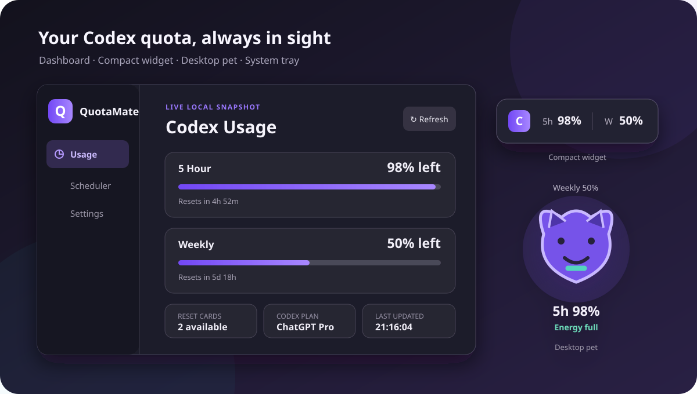

<div align="center">
  
  <h1>QuotaMate</h1>
  <p><strong>A lightweight, local-first Codex quota companion for the macOS menu bar and Windows tray</strong></p>
  <p>
    <a href="README.md">简体中文</a> · <a href="README_EN.md">English</a>
  </p>
  <p>
    
    
    
    
    
  </p>
</div>

QuotaMate keeps your Codex **5-hour quota, weekly quota, reset countdowns, and quota reset cards** visible on the desktop and in the system tray. Choose a minimal quota bar or a lively desktop pet that reacts to your remaining usage—without repeatedly opening Codex.

It talks directly to the Codex CLI already installed and authenticated on your computer. You never need to paste a token, no webpage is scraped, and quota data is not sent to a QuotaMate-operated server.

> [!IMPORTANT]
> QuotaMate is an independent community project and is not an official OpenAI product. It supports Windows x64 and includes an Apple Silicon macOS build.

<p align="center">
  
</p>

## Desktop Pet: make quota feel alive

QuotaMate is not meant to be another cold statistics panel. Its signature feature turns the frequently changing **5-hour quota into a character that lives on your desktop**. You do not have to study a progress bar—a glance at the pet's expression, color, and energy tells you whether Codex is ready for another intensive session.

<p align="center">
  
</p>

### It feels your 5-hour quota

| 5h remaining | Pet state | Visual response |
| --- | --- | --- |
| `75%–100%` | Fully charged | Blue energy, a happy face, and livelier glow effects |
| `45%–74%` | Doing well | Green energy, a relaxed face, and gentle breathing motion |
| `20%–44%` | Low energy | Orange warning, a neutral face, and a visibly shorter meter |
| `0%–19%` | Needs charging | Red warning, a tired expression, and a low-energy pose |

Pet state follows the frequently changing 5-hour quota first. Weekly quota is used only when Codex does not return 5-hour data.

### It is more than a static sticker

- Every pet gently floats up and down, keeping the desktop alive without demanding attention.
- The violet fox blinks, wags its tail, twitches its ears, and sparkles when fully charged.
- The rocket changes fuel and flame, the car shows battery segments, and the robot and dog react with expressions and energy meters.
- Click the pet to reveal full quota details; move the pointer away to return to the clean pet view.
- Hold the left mouse button to drag it, or right-click to switch modes, open QuotaMate, or close the floating display.

### Bring your own desktop character

In addition to the violet fox, dog, rocket, car, and robot, QuotaMate accepts transparent `PNG`, `WebP`, and animated `GIF` files:

- Imported images are copied into QuotaMate's local configuration directory, so the original file does not need to remain in place.
- Import history lets you quickly reselect a pet or remove its local copy.
- Custom images also receive gentle floating motion and a quota-colored energy glow.
- Animated GIFs retain their own animation; static custom art is not forced into artificial facial expressions.
- Pet size, overall opacity, and always-on-top behavior are adjustable.

## More than a percentage

Open the dashboard, Compact Widget details, or Desktop Pet details to see:

- The current Codex/ChatGPT plan, such as `ChatGPT Plus`, `ChatGPT Pro`, or another value returned by the service.
- 5-hour and weekly quota, remaining percentages, and reset times.
- Available quota reset cards, grant times, and expiration times.
- The next Scheduler trigger and the last quota update time.

The plan comes from the official Codex App Server `planType` field. When the active account or authentication method does not provide it, QuotaMate clearly displays “Not provided.”

## Supporting experience

| Capability | What it provides |
| --- | --- |
| Minimal quota display | Show 5h and/or Weekly directly in the macOS menu bar; Windows keeps the desktop widget. |
| Local first | Reuses the existing Codex login, asks for no authentication token, and needs no additional service. |
| Tray controls | Keep QuotaMate running after closing the window; refresh, switch modes, manage startup, or exit quickly. |
| Multiple monitors | Move the main window and floating displays between screens; floating positions are remembered. |
| Chinese and English | Follow the operating-system language automatically or choose a language manually. |

## Features

### 1. Usage dashboard

- Displays both Codex 5-hour and weekly quota windows.
- Displays the current Codex/ChatGPT plan, such as Plus, Pro, or Go, with a clear fallback when unavailable.
- Shows remaining percentage, reset countdown, exact reset time, and last update time.
- Shows available quota reset cards, grant times, and expiration times when returned for the account.
- Supports manual refresh and receives live quota update notifications from Codex.
- Clearly marks missing account data as unavailable instead of inventing a value.

### 2. Compact Mode

Designed for users who want the smallest possible desktop footprint. macOS shows the selected values directly in the menu bar; Windows keeps the compact desktop widget.

- Show only `5h`, only `Weekly`, or both.
- Collapsed width automatically follows the selected content.
- Click to expand details; move the pointer away to collapse.
- Hold the left mouse button and move to drag; lock the position to prevent accidental movement.
- Right-click to open QuotaMate, switch to the Desktop Pet, or close the floating display.

### 3. Desktop Pet

The pet turns your frequently changing 5-hour quota into an immediate visual state.

- Includes a violet fox, dog, rocket, car, and robot.
- Expressions, theme color, fuel, and battery effects react to the 5-hour quota.
- Weekly quota appears above the pet, while 5-hour quota and energy state appear below it.
- Supports custom transparent PNG, WebP, and GIF images.
- Keeps a local custom-image history for quick reselection or removal.
- Adjustable size, opacity, and always-on-top behavior.
- Click the pet for full details; move away to return to pet mode.

### 4. macOS menu bar and Windows system tray

QuotaMate stays in the macOS menu bar or Windows notification area like a conventional desktop companion.

- Left-click the tray icon to open the main window.
- Hover over it for a quick 5-hour and weekly quota summary.
- Right-click to open QuotaMate, switch Compact/Pet/Hidden mode, refresh, open Scheduler or Settings, toggle launch at startup, or exit.
- The selected display mode and startup setting are marked with `●`.

### 5. Daily Scheduler

Configure multiple local times at which QuotaMate starts a tiny, ephemeral Codex session once per day:

- Runs from an isolated QuotaMate runtime directory.
- Uses a read-only sandbox and does not use your project directory as its working directory.
- Saves no Codex conversation, performs no automatic retry, and times out after 120 seconds.
- Each trigger runs at most once per local calendar day.
- Missed triggers during shutdown, sleep, or a complete QuotaMate exit are not replayed later.

> [!NOTE]
> Scheduler triggers call Codex and may consume a small amount of quota. Leave the trigger list empty or disable the Scheduler if you do not need it.

## How it works

<p align="center">
  
</p>

QuotaMate locates `codex.exe` on the computer, starts the official Codex App Server, and reads the quota information returned for the active account. The frontend communicates with the Rust backend only through local Tauri IPC.

## Quick start

Build from source on an Apple Silicon Mac:

```bash
pnpm install
pnpm tauri:build:mac
```

Bundles are written to `artifacts/macos-arm64/`. The dedicated script stages the build in a local temporary directory to avoid `._*` AppleDouble files created by some external drives.

### Requirements

- macOS 10.15 or later (the current build targets Apple Silicon/arm64), or Windows 10/11 (x64)
- Windows requires Microsoft Edge WebView2 Runtime (preinstalled on most Windows 10/11 systems); macOS uses system WebKit
- Codex CLI installed and signed in, or a Codex desktop installation that includes the CLI

QuotaMate first searches for `codex.exe` in the system `PATH`, then checks the location used by the Codex desktop app.

### Download

Open the repository's [Releases](../../releases/latest) page. The installer is recommended for most users:

```text
QuotaMate_0.1.0_x64-setup.exe
```

For a single-file, no-install option, download:

```text
quotamate.exe
```

The standalone executable runs without installation, but configuration, logs, and custom pet images are still stored in the current Windows user's application-data directories. It is therefore not a completely zero-footprint portable app.

> [!WARNING]
> Current releases are not signed with a publicly trusted code-signing certificate. Windows may show an “Unknown publisher” or SmartScreen warning on first launch. Verify that the file came from this repository's Releases page before selecting “More info” → “Run anyway.”

### First run

1. Make sure Codex is installed and signed in.
2. Start QuotaMate and wait for the first quota snapshot.
3. Open Settings and choose either the Compact Widget or Desktop Pet.
4. Adjust visible quota windows, opacity, pet scale, always-on-top behavior, and refresh interval.
5. Closing the main window leaves QuotaMate in the tray. Select Exit from the tray menu to stop it completely.

## Interaction reference

| Location | Action | Result |
| --- | --- | --- |
| Tray icon | Left-click | Open the QuotaMate main window |
| Tray icon | Right-click | Open the quick menu |
| Collapsed widget/pet | Click and release | Expand detailed quota information |
| Collapsed widget/pet | Hold left button and move | Drag the floating display |
| Expanded widget/pet | Move the pointer away | Return to compact/pet mode |
| Widget/pet | Right-click | Open the floating-display quick menu |

## Privacy and security

- Does not ask users to enter, copy, or import access tokens.
- Does not write Authorization headers, cookies, or Codex conversation content.
- Does not upload quota information to a QuotaMate-operated server or another third-party service.
- Stores configuration, custom pet images, and runtime logs locally.
- Redacts diagnostic log entries that may contain authentication material.
- Scheduler sessions use an isolated runtime directory, ephemeral execution, and a read-only sandbox.

## FAQ

<details>
<summary><strong>Why does QuotaMate say Codex is unavailable or keep waiting for data?</strong></summary>

Confirm that Codex CLI is installed and signed in, and that `codex --version` works in a terminal. Then choose Refresh usage from the tray menu or restart QuotaMate.
</details>

<details>
<summary><strong>Why did the pet previously show low energy after the 5h quota reset?</strong></summary>

Starting with the current version, pet state follows the 5-hour quota first. Weekly quota is used only as a fallback when Codex does not return 5-hour data.
</details>

<details>
<summary><strong>Will Scheduler triggers run while the computer is turned off?</strong></summary>

No. QuotaMate is not a Windows Task Scheduler service. A trigger missed while the computer is off or asleep, or while QuotaMate is fully exited, is not replayed later.
</details>

<details>
<summary><strong>Do I need to publish the entire target/release directory?</strong></summary>

No. Files such as `.pdb`, `.dll`, `.lib`, and `.d` are build or debugging artifacts. End users only need the installer or the standalone `quotamate.exe`.
</details>

## Development

### Prerequisites

- Node.js and pnpm
- Rust stable with the MSVC toolchain
- Visual Studio C++ Build Tools
- Codex CLI installed and signed in

```powershell
# Install dependencies and start the development app
pnpm install
pnpm tauri dev

# Build the frontend
pnpm build

# Run Rust unit tests
cd src-tauri
cargo test --lib
```

Build the standalone executable:

```powershell
pnpm tauri build --no-bundle
```

Build the NSIS installer:

```powershell
pnpm tauri build
```

Default output locations:

```text
src-tauri/target/release/quotamate.exe
src-tauri/target/release/bundle/nsis/QuotaMate_<version>_x64-setup.exe
```

## Stack and repository layout

- [Tauri 2](https://tauri.app/) for cross-platform windows, the macOS menu bar, the Windows system tray, and local IPC
- [Rust](https://www.rust-lang.org/) for Codex App Server, configuration, Scheduler, and window management
- [React](https://react.dev/) + [TypeScript](https://www.typescriptlang.org/) for the main UI and floating displays
- [Vite](https://vite.dev/) for frontend development and builds

```text
QuotaMate/
├─ src/                         # React UI, floating displays, pets, i18n
├─ src-tauri/src/codex/         # CLI discovery, App Server, quota parsing
├─ src-tauri/src/config/        # Local configuration and migrations
├─ src-tauri/src/scheduler/     # Daily Scheduler
├─ src-tauri/src/tray/          # macOS menu bar and Windows system tray
├─ src-tauri/src/windows/       # Main and floating window lifecycle
├─ docs/images/                 # README product illustrations
└─ src-tauri/src/commands.rs    # Frontend/backend IPC commands
```

## Project status and feedback

QuotaMate is still an early-stage project. Quota fields may differ across Codex CLI versions or account types; information not returned by the active account is shown as unavailable.

Bug reports, feature ideas, and UI feedback are welcome through GitHub Issues. Before attaching logs or screenshots, make sure they contain no account credentials or other sensitive information.
